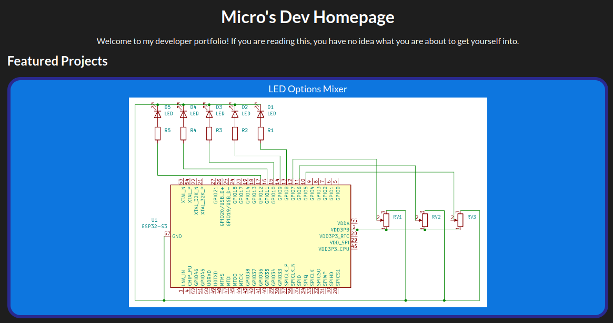

# Micro's Dev Homepage

## About
LINK: https://microchip818.github.io/Micro-Dev-Homepage/

The website is a portfolio/showcase of my technical work. It consists of three pages:

1. Homepage - displays a curated list of featured projects.
2. About Me - information about myself.
3. Projects - a full list of all my projects, sorted by type (hardware/software).

This project was made with HTML and CSS, but I also experimented with JS on the side. I plan to implement core JS features later down the line.

## AI Declaration
- I used ChatGPT for minor debugging issues and to get the Lato font stylesheet reference.